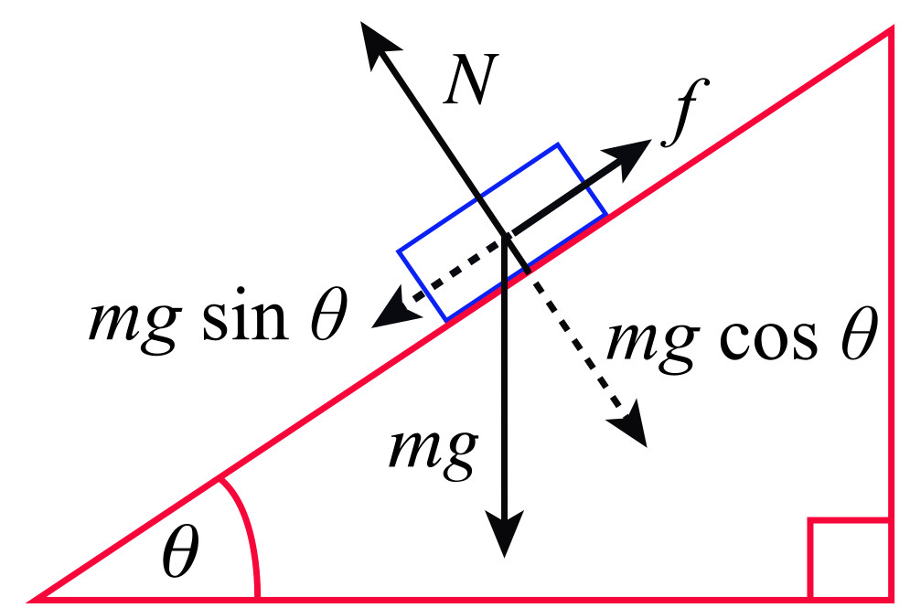

# AID Coding Challenge Solution

This is my solution for the AID Bachelor Coding Challenge. 
For the problem description refer to the [AID Coding Challenge.pdf](AID Coding Challenge.pdf). 
The complete doxygen documentation can be found in the doc folder, see [index.html](doc/html/index.html)

# Result Preview

Travelling from the Rover (ROVER_X, ROVER_Y) to the Bachelor (BACHELOR_X, BACHELOR_Y) will take
2094.51 island seconds (34.9085 island minutes or 0.581809 island hours) on the fastest path.

Travelling from the Bachelor (BACHELOR_X, BACHELOR_Y) to the Wedding (WEDDING_X, WEDDING_Y) will
take 1283.17 island seconds (21.3862 island minutes or 0.356436 island hours) on the fastest path.

In total the Audi rover requires 3377.68 island seconds (56.2947 island minutes or 0.938245 island hours) on the fastest path.
Details are explained at the end in section Results. To plot the path I added another path() function to the visualizer.cpp.

image html solution_rover_bachelor_wedding.jpg

# Algorithm Choice

To find the fastest route from a start to a goal location, I considered Gradient Fields, 
Dynamic Programming and Graph Search algorithms. I decided to use A* graph search because it is
an informed search algorithm, which uses a heuristic function \f$h(n)\f$ and relies on dynamic programming
to find the shortest path. Compared to Dijkstra, which is an uninformed algorithm. The heuristic provides A*  
 with an estimate of the minimum cost from any node n to the goal. 

Another reason against Gradient descent are the non-convex constraints imposed by the fjords. Gradient descent could
easily fall into a lokal minimum and get stuck, which would require methods such as stochastic gradient descent.

## Cost Function

The evaluation function \f$f(n) = g(n) + h(n)\f$ describes the total cost of a node. 
It consists of the path cost \f$g(n)\f$, which describes how long it takes the rover to get to node \f$n\f$ from its start location.

The path cost \f$g(n)\f$ is calculated using the parent node's path cost \f$g(parent)\f$ and the step cost \f$c(n)\f$,
which is the cost of getting from the parent to the current node and that has to be positive. The step cost is described in the next 
section \ref step-cost.

In this challenge the heuristic represents the time it takes the robot to move from a node to the goal.
Because the robot can move in eight directions (straight and diagonal) I use an octile distance heuristic \f$h(n)\f$, 
implemented in cPlanner::UpdateHeuristic(). To get a consistent heuristic, I scaled it using the maximum
gradient analyzing the elevation of the map and taking the slope into account. The consistency \f$ h(n) <= c(n,p) + h(p)\f$ is checked in 
planner::cPlanner::HeuristicCheck(). I exported the calculated heuristic values using planner::cPlanner::GenerateHeuristic()
in the google test TEST_F(cPlannerTest, heuristic) (see, test_system.cpp).

image html heuristic.jpg

## Step Cost Model

Another task was to model the speed of the rover when driving up or downhill. 
For this purpose I implemented a simple kinematic approach with an inclined plane to model 
the elevation of the terrain. 

image html inclined.jpg

The first step is to calculate the descent or ascent using the height difference
between two locations, see planner::cPlanner::UpdateCost(). In this method
the pitch angle is calculated next, followed by computing the x or y component of the downhill-slope force using
the gravitational force \f$F_G\f$. In the equation the friction is neglected.

\f{eqnarray*}{
F_H &= F_G \cdot sin\alpha \\
a_H &= g \cdot sin\alpha \\
F_{H,x} &= F_H \cdot cos\alpha \\ 
F_{H,x} = F_H \cdot cos\alpha \cdot sin\alpha = F_G \cdot \frac{1}{2} sin(2\alpha) \\
m \cdot a_x = m \cdot g \cdot \frac{1}{2} sin(2\alpha)
\f}

While the rover is moving up or downhill it is also moving in the x or y direction and the calculated acceleration 
\f$a_x\f$ in x direction is acting on the rover. The same equation holds for the y-direction. To get the time it takes 
the rover to move up or downhill (regarding the two dimensional plane), the planar acceleration
is used in the next kinematic equation, where \f$\Delta s\f$ refers to the running length in either x or y direction.

\f{eqnarray*}{
\Delta s &= v_0 \cdot t + \frac{1}{2} a_x t^2  \\
\Delta s &= \frac{g}{4} \cdot sin(2\alpha) \cdot t^2 \\
t &= \sqrt(\frac{4 \Delta s}{g \cdot sin(2\alpha}) 
\f}

The start velocity is neglected in this formula but added to the final height time cost. The time it takes the rover
to move one cell is given in the problem description (1 island second moving straight, and \f$\sqrt 2\f$
moving diagonal). These step costs are implemented in planner::cPlanner::UpdateCost().

# Time and Space Complexity

I avoid allocating two dimensional vectors of the image size. Instead I am using a std::priority_queue priority_queue.h 
(planner::cPlanner::m_poFrontier) and a std::map.
The priority queue is sorted by the score value of the evaluation function \f$f(n)\f$ and contains the frontier or
border nodes. All expanded nodes are stored in an std::map inside the planner::cPlanner::AStar() method together with 
their path costs \f$g(n)\f$.

The priority queue is suggested in all the literature and can access elements in linear time. With a step size of 
one the algorithm requires approximately 2 minutes to find the best path from rover to bachelor to the wedding. 
(MacBook Pro 3,3 GHz Intel Core i7, 16 GB 2133 MHz LPDDR3).

# Software Organization and Architecture

The advantage of using interfaces is to get different implementations with different behavior but keep the public
interface methods the same. I use two interfaces that have a reference to each other, 
planner::cRoverInterface and planner::cPlannerInterface. The planner::cAudiRover implements planner::cRoverInterface 
and acts as a factory, creating planner::cPlanner in planner::cRoverInterface::InitializePlanner(). To construct
a Rover it requires the map data (<code>elevation.data</code> and \code overrides \endcode). This data is used
int the constructor of planner::cAudiRover to create a new map data structure of type tGraph. In the constructor
the array of actions is initizlized which is flexible due to the template parameter of the base class 
planner::cRoverInterface<size_t Directions>. 
To start planning, the start and goal positions of the rover need to be set with planner::cRoverInterface::SetStart()
and planner::cRoverInterface::SetGoal(). These methods provide the rover with location structs of type tLocation. 
After the initialization, a call to the method planner::cAudiRover::Summon(), invokes the method 
planner::cAudiRover::InitializePlanner() which is part of the interface and used to create a new planner object.
Finally the the interface method planner::cPlannerInterface::Plan() is called. 
Possible parameters to planner::cAudiRover::Summon() are the step size planner::cRoverInterface::m_nStepSize and its velocity
planner::cRoverInterface::m_nVelocity (not tested \ref testing).

During the the while loop of the AStar() method, debug messages are displayed every 100000 iterations in the following form:

\code
Max gradient 8
Iteration 100000: Best node location (1406,338), 
	 Evaluation function f(n): 423.181, step cost c(n): 0.654846, path cost g(n): 320.498, heuristic h(n): 102.683
Iteration 200000: Best node location (1299,592), 
	 Evaluation function f(n): 654.874, step cost c(n): 2.17358, path cost g(n): 573.159, heuristic h(n): 81.7151
Iteration 300000: Best node location (1330,782), 
	 Evaluation function f(n): 831.174, step cost c(n): 1, path cost g(n): 769.743, heuristic h(n): 61.4311
Iteration 400000: Best node location (1565,567), 
	 Evaluation function f(n): 917.657, step cost c(n): 1.41418, path cost g(n): 844.46, heuristic h(n): 73.1971
\endcode

## CMake and File Structure

I added a new planner library which gets linked by the main program Bachelor. To get the visualization working during
the algorithm I placed the functions inside the main.cpp inside utilities.h and constants.h. The content of other
files is documented in the Doxygen documentation.  

# Coding Style

For the variable naming conventions, I follow the [MISRA C](https://en.wikipedia.org/wiki/MISRA_C) standard. 

# Testing

\b Note The tests are not completely finished because of the limited time.

I added google gTest version 1.8.0 to the zip file and created a test fixture cPlannerTest in test_fixture.h.
It is used to initialize the test by loading the evaluation.data and overrides.data files. Furthermore, the
cAudiRover is initialized in the cPlannerTest::SetUp method. 

As explained in \ref software the default values for step size and velocity are set to one for both parameters. I tested with 
different step sizes to reach the goal faster, thereby verifying that the path and island seconds stay the same. 

To get intermediate paths from the planner::cPlanner::AStar() I used the provided visualizer::writeBMP() inside AStar().
This results in the following output:

## Results

The total travelling time will take 3377.68 island seconds (56.2947 island minutes or 0.938245 island hours) on the fastest path.
Hopefully this is enough for the Bachelor to get to his wedding on time.

image html solution_rover_bachelor_wedding.jpg

The best path avoids high mountains and even gets close to see locations (bachelor to wedding) to find the fastest route.

\code
Max gradient: 8, Consistency factor: 10
Iteration 100000: Best node location (334,1646), 
	 Evaluation function f(n): 455.802, step cost c(n): 1.63855, path cost g(n): 259.565, heuristic h(n): 196.237
Iteration 200000: Best node location (413,1697), 
	 Evaluation function f(n): 582.518, step cost c(n): 1.63855, path cost g(n): 384.453, heuristic h(n): 198.065
Iteration 300000: Best node location (495,1121), 
	 Evaluation function f(n): 741.235, step cost c(n): 1.40002, path cost g(n): 604.166, heuristic h(n): 137.068
Iteration 400000: Best node location (222,996), 
	 Evaluation function f(n): 815.994, step cost c(n): 1.40002, path cost g(n): 670.159, heuristic h(n): 145.835
Iteration 500000: Best node location (426,904), 
	 Evaluation function f(n): 863.824, step cost c(n): 1.40002, path cost g(n): 742.2, heuristic h(n): 121.624
Iteration 600000: Best node location (693,1925), 
	 Evaluation function f(n): 923.431, step cost c(n): 1, path cost g(n): 714.164, heuristic h(n): 209.267
Iteration 700000: Best node location (733,1933), 
	 Evaluation function f(n): 1015.57, step cost c(n): 1, path cost g(n): 807.162, heuristic h(n): 208.41
Iteration 800000: Best node location (877,1969), 
	 Evaluation function f(n): 1095.94, step cost c(n): 1.40002, path cost g(n): 889.893, heuristic h(n): 206.046
Iteration 900000: Best node location (747,840), 
	 Evaluation function f(n): 1178.13, step cost c(n): 1.40002, path cost g(n): 1079.6, heuristic h(n): 98.5303
Iteration 1000000: Best node location (868,1036), 
	 Evaluation function f(n): 1290.78, step cost c(n): 2.15552, path cost g(n): 1177.67, heuristic h(n): 113.118
Iteration 1100000: Best node location (837,623), 
	 Evaluation function f(n): 1370.08, step cost c(n): 1, path cost g(n): 1296.97, heuristic h(n): 73.1023
Iteration 1200000: Best node location (1023,906), 
	 Evaluation function f(n): 1426.84, step cost c(n): 0.644409, path cost g(n): 1333.14, heuristic h(n): 93.698
Iteration 1300000: Best node location (1060,512), 
	 Evaluation function f(n): 1473.57, step cost c(n): 2.37537, path cost g(n): 1420.8, heuristic h(n): 52.7654
Iteration 1400000: Best node location (819,1313), 
	 Evaluation function f(n): 1518.79, step cost c(n): 1, path cost g(n): 1375.94, heuristic h(n): 142.848
Iteration 1500000: Best node location (1141,719), 
	 Evaluation function f(n): 1559.78, step cost c(n): 2.24475, path cost g(n): 1489.67, heuristic h(n): 70.1103
Iteration 1600000: Best node location (943,329), 
	 Evaluation function f(n): 1593.74, step cost c(n): 2.15552, path cost g(n): 1547.64, heuristic h(n): 46.1068
Iteration 1700000: Best node location (936,273), 
	 Evaluation function f(n): 1631.22, step cost c(n): 1, path cost g(n): 1586.74, heuristic h(n): 44.4872
Iteration 1800000: Best node location (1326,1140), 
	 Evaluation function f(n): 1669.75, step cost c(n): 2.15552, path cost g(n): 1563.3, heuristic h(n): 106.453
Iteration 1900000: Best node location (1078,1322), 
	 Evaluation function f(n): 1704.56, step cost c(n): 1, path cost g(n): 1571.54, heuristic h(n): 133.02
Iteration 2000000: Best node location (1053,1445), 
	 Evaluation function f(n): 1738.76, step cost c(n): 1.63855, path cost g(n): 1592.4, heuristic h(n): 146.355
Iteration 2100000: Best node location (974,96), 
	 Evaluation function f(n): 1773.15, step cost c(n): 1.40002, path cost g(n): 1739.8, heuristic h(n): 33.3556
Iteration 2200000: Best node location (1342,1376), 
	 Evaluation function f(n): 1817.68, step cost c(n): 0.644409, path cost g(n): 1686.97, heuristic h(n): 130.715
Iteration 2300000: Best node location (1421,397), 
	 Evaluation function f(n): 1890.01, step cost c(n): 1.63855, path cost g(n): 1853.92, heuristic h(n): 36.0877
Iteration 2400000: Best node location (1519,1058), 
	 Evaluation function f(n): 1950.36, step cost c(n): 1, path cost g(n): 1844.11, heuristic h(n): 106.247
Iteration 2500000: Best node location (1398,265), 
	 Evaluation function f(n): 2009.98, step cost c(n): 1.40002, path cost g(n): 1988.04, heuristic h(n): 21.935
Iteration 2600000: Best node location (1379,182), 
	 Evaluation function f(n): 2058.23, step cost c(n): 1, path cost g(n): 2045.38, heuristic h(n): 12.848
Travelling will take 2094.51 island seconds (34.9085 island minutes or 0.581809 island hours) on the fastest path. 
Max gradient: 8, Consistency factor: 10
Iteration 100000: Best node location (1416,333), 
	 Evaluation function f(n): 422.513, step cost c(n): 0.64447, path cost g(n): 319.744, heuristic h(n): 102.769
Iteration 200000: Best node location (1433,610), 
	 Evaluation function f(n): 653.168, step cost c(n): 1.63855, path cost g(n): 578.803, heuristic h(n): 74.3647
Iteration 300000: Best node location (1328,779), 
	 Evaluation function f(n): 829.594, step cost c(n): 1.40002, path cost g(n): 767.78, heuristic h(n): 61.8139
Iteration 400000: Best node location (1629,647), 
	 Evaluation function f(n): 915.408, step cost c(n): 1.40002, path cost g(n): 848.555, heuristic h(n): 66.8539
Iteration 500000: Best node location (1699,588), 
	 Evaluation function f(n): 1000.31, step cost c(n): 1.40002, path cost g(n): 924.657, heuristic h(n): 75.6534
Iteration 600000: Best node location (1512,1083), 
	 Evaluation function f(n): 1079.1, step cost c(n): 1.40002, path cost g(n): 1055.3, heuristic h(n): 23.7924
Iteration 700000: Best node location (1324,1112), 
	 Evaluation function f(n): 1130.77, step cost c(n): 1, path cost g(n): 1097.93, heuristic h(n): 32.8387
Iteration 800000: Best node location (1759,1086), 
	 Evaluation function f(n): 1179.28, step cost c(n): 1.40002, path cost g(n): 1150.94, heuristic h(n): 28.3387
Heuristic not consistent: 61.3867 > 0.0733643 + 61.2453
Heuristic not consistent: 97.5835 > 0.0692139 + 97.4835
Iteration 900000: Best node location (1166,1154), 
	 Evaluation function f(n): 1222.19, step cost c(n): 1, path cost g(n): 1175.29, heuristic h(n): 46.899
Iteration 1000000: Best node location (1222,1144), 
	 Evaluation function f(n): 1262.49, step cost c(n): 1, path cost g(n): 1220.77, heuristic h(n): 41.7132
Travelling will take 1283.17 island seconds (21.3862 island minutes or 0.356436 island hours) on the fastest path. 

Travelling will take 3377.68 island seconds (56.2947 island minutes or 0.938245 island hours) on the fastest path.  
\endcode

Notice that the heuristic is not always consistent which requires more weight on the \f$g\f$ score values. This can also be seen
from the f score value which should stay the same because it is the sum of \f$ g(n) + h(n) \f$. \f$g(n)\f$
should increase, while \f$h(n)\f$ should decrease when moving to the goal. Tuning could be done in 
planner::cPlanner::CalculateConsistencyFactor(), for example by lowering the gravitational force.

## Intermediate Paths

As described above here is the image showing the indermediate path results that were explored by A*.

image html intermediate_rover_bachelor_wedding.bmp

# References

\li Artificial Intelligence A Modern Approach Third Edition - Stuart Russel, Peter Norvig
\li Head First Design Patterns - Eric Freeman, Elisabeth Robson
\li https://autonomous-driving.org/2018/08/15/so-you-want-to-be-a-self-driving-car-engineer/
\li https://www.linkedin.com/pulse/software-quality-sami-vaaraniemi/
\li https://en.wikipedia.org/wiki/A*_search_algorithm
\li https://en.wikipedia.org/wiki/Consistent_heuristic
\li https://en.wikipedia.org/wiki/Admissible_heuristic
\li https://www.redblobgames.com/pathfinding/a-star/introduction.html
