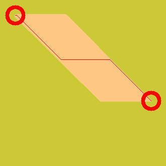
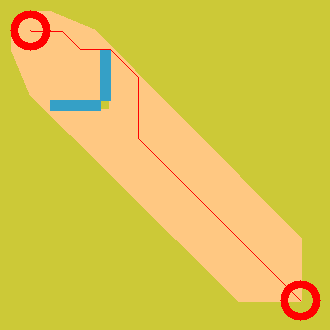
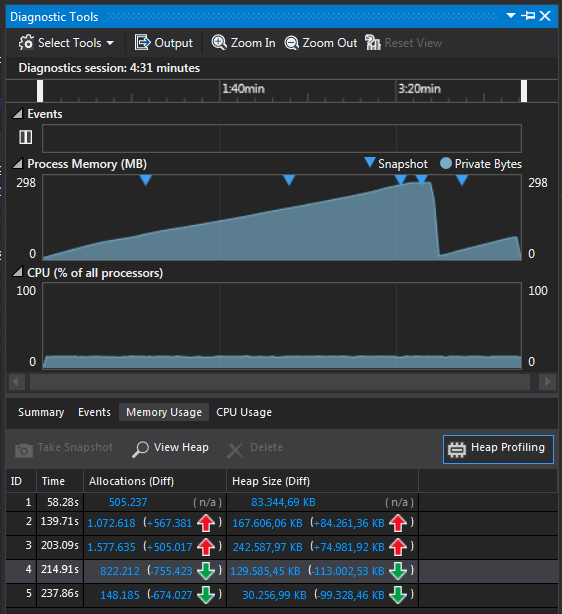
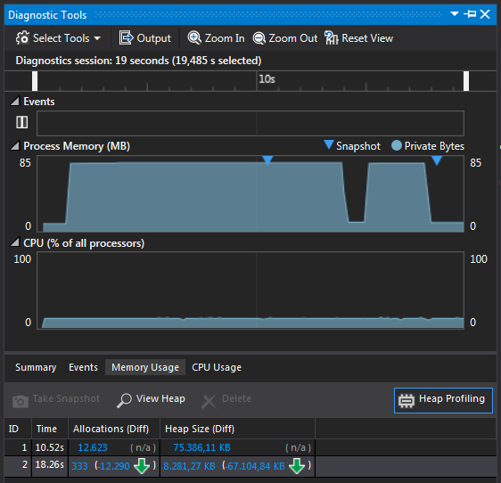
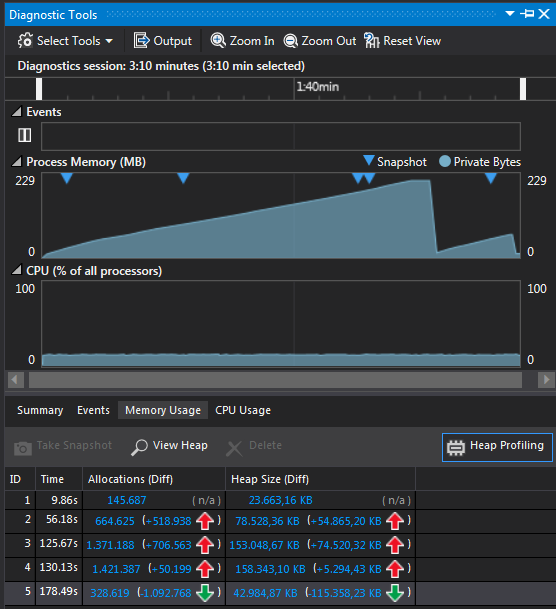

# AID Coding Challenge Solution

This is my updated solution for the AID Bachelor Coding Challenge. 
The readme of the previous version can be found [here](README_v0.md).
For the problem description refer to the [AID Coding Challenge.pdf](AID_Coding_Challenge.pdf). 
The complete doxygen documentation can be found in the doc folder, see [index.html](doc/html/index.html)

## Result

The figure below shows the optimal path with the following planning results:

```
Travelling will take 1322.29 island seconds (22.0381 island minutes or 0.367302 island hours) on the fastest path. 
Cumulative elevation: 42939
Number of expanded nodes: 315920
Heuristic is consistent
```


## Main New Features

Beside the fixed bug of setting the diagonal cost to 1.4f instead of sqrt(2) I made the following changes to my solution.

### Simplified Motion Model

I simplified the step cost model of the rover. 
Instead of the physical model, used previously, the rover now uses height costs that 
are percentage values of the current step cost, which are either `1` when moving straight or sqrt(2)` when moving diagonal.
The percentage step cost (height cost) is added to the current step cost if the rover moves uphill and subtracted 
if it moves downhill. This height cost calculation takes place in planner::cPlanner::HeightCost.

### Consistent Heuristic

A consistent heuristic is ensured with the chosen step cost and height cost model. 
This is achieved by calculating a normalization factor 
`m_fConsistencyFactor = 1.f - static_cast<double>(m_nMaxGradient) / 255.0;`. I assume that `255` is 
the maximum that the rover can climb or fall, which is why I divide by 255.0. The normalization factor
is then used to normalize the calculated octile heuristic value in planner::cPlanner::Heuristic.
To check the consistency of the heuristic during A* I perform the check: 
h(x) <= d(x,y) + h(y) with x as parent node and y as its successor.
In case of an inconsistent heuristic the boolean flag bConsistentHeuristic in the new member struct 
planner::tResult of cPlannerInterface is set to false. This boolean flag is tested against in the gTests.

### Memory Leaks

I analyzed my previous implementation using valgrind which showed memory leaks when creating child nodes in planner::cPlanner::Child.
Additionally because of not destructing the planner and audi rover objects correctly. 
To overcome these memory leaks I now use smart pointers which are a C++11 feature.
The valgrind results for the planner and gTest project are shown in [doc/valgrind.xml](doc/valgrind.xml) 
and [valgrind_gtest.xml](valgrind_gtest.xml) respectively. See also the memory usage in the Memory Usage section below.

### Implementation Correctness

To verify the correctness of my implemented AStar algorithm, I added two more implementations.
1. [Wikipedia A* Pseudocode](https://en.wikipedia.org/wiki/A*_search_algorithm#Pseudocode) implemented in class planner::cPlannerWiki which inherits from planner::cPlanner.
2. [Red Blob Games A*](https://www.redblobgames.com/pathfinding/a-star/implementation.html#cplusplus) implemented in class planner::cPlannerRBG which inherits from planner::cPlanner.

Both use less memory than my previous implementation, which can still be found in planner::cPlanner::AStar. 
Less memory usage is achieved with other data structures. 
For example the node struct in Red Blob Games implementation uses less fields (see planner::tSimplifiedNode).
Regarding the computation time, planner::cPlannerWiki::AStar is the fastest implementation. 
Here preallocated vectors are used instead of a priority queue that needs to be updated in the other implementations.

### gTests using Simple Maps

The mentioned implementations are used in new gTests which create and use simple maps to test if the different 
implementations yield the same results (regarding travelling time given in island seconds).
All test results are found in [doc/TestResults-testPlanner.html](doc/TestResults-testPlanner.html).

1. simple_map creates a 330x330 map with elevation 1 to check if the implementations find a path from 
the start to the goal location.



2. simple_map_with_water creates a 330x330 map with elevation 1 and water such that the greediness and therefore the heuristic is evaluated.



All the implementations find a shortest, passing the water obstacle.

3. simple_map_with_elevation is a 4x4 map with elevation 1 except the diagonal is set to 255. The rover needs to find a path between the left top corner (x,y)=(0,0) and the bottom right corner (x,y)=(3,3). This test is used to check the step cost, which is combination of height cost and direction cost. Furthermore, the consistency of the heuristic is evaluated.


Additional test results can be seen in the image folder [doc/images/test](doc/images/test).

## C++11 Features

Used [C++11 features](https://github.com/AnthonyCalandra/modern-cpp-features):
- smart pointer: 
    - [std::shared_ptr](https://en.cppreference.com/w/cpp/memory/shared_ptr), 
    - [std::weak_ptr](https://en.cppreference.com/w/cpp/memory/weak_ptr), 
    - [std::enable_shared_from_this](https://en.cppreference.com/w/cpp/memory/enable_shared_from_this), 
    - [shared_from_this()](https://en.cppreference.com/w/cpp/memory/enable_shared_from_this/shared_from_this), 
    - [nullptr](https://en.cppreference.com/w/cpp/language/nullptr)
- [Lambda expression](https://en.cppreference.com/w/cpp/language/lambda)
- [List initialization](https://en.cppreference.com/w/cpp/language/list_initialization)
- [Rvalue reference](https://en.cppreference.com/w/cpp/language/reference)
- [std::move](https://en.cppreference.com/w/cpp/utility/move)
    
## Memory Usage

The images below show the memory usage and runtime of the different A* implementations.

AStar             |  AStar Wikipedia | AStar Red Blob Games
:-------------------------:|:-------------------------:|:------------------------------------------------:
  |   |  
270.5 MB, 4:30 min         |   77.2 MB, 19.48 sec      |  208.1 MB, 3 min


## Class Design

There exists a cyclic dependency between the rover interface and planner interface where the rover acts as a 
[factory](https://en.wikipedia.org/wiki/Factory_method_pattern) to create different planners.

The new implementations cPlannerWiki and cPlannerRBG inherit cPlanner which implements the interface.


### Complete Changelog

- Fixes diagonal cost value: uses sqrt(2) for the diagonal cost instead of 1.4f.
- Fixes memory leaks caused by dangling pointers, mainly in the Child() method of planner.cpp.
    - Valgrind shows no memory leaks anymore with the use of smart pointers (C++11 feature)
    - Now using smart pointers for the nodes
    - Uses [shared_ptr](https://en.cppreference.com/w/cpp/memory/shared_ptr), [std::weak_ptr](http://en.cppreference.com/w/cpp/memory/weak_ptr), 
    [std::enable_shared_from_this](http://en.cppreference.com/w/cpp/memory/enable_shared_from_this) and [shared_from_this()](https://en.cppreference.com/w/cpp/memory/enable_shared_from_this/shared_from_this)
    for the cyclic dependency between rover interface and planner interface.
    - Use of smart pointers reduces memory consumption from approx 2 GB to 570 MB. This high memory is caused by creating
    child nodes while exploring new locations. Each node contains information that increase the memory used each time a new node is created.
- Uses double instead of float for the cost values to improve numerical inaccuracy because of diagonal step cost sqrt(2).
- To verify the correctness of the current implementation this version adds two more implementations of A*,
one from [Wikipedia](https://en.wikipedia.org/wiki/A*_search_algorithm#Pseudocode) and
the other from [Red Blob Games](https://www.redblobgames.com/pathfinding/a-star/implementation.html#cpp-astar).
- The new A* implementations use less memory 
- Simplifies step cost model of the rover: instead of the physical model the rover now uses height costs that are percentage values of the step cost.
The percentage step cost (height cost) is added to the current step cost if the rover moves uphill and subtracted if it moves downhill.
The height cost calculation takes place in planner::cPlanner::HeightCost().
- Ensures consistent heuristic with the chosen step cost and height cost model. This is achieved by normalizing the 
calculated octile heuristic value in planner::cPlanner::Heuristic().
- Fixes calculation of consistency output: h(x) <= d(x,y) + h(y) with x as parent node and y as its successor.
- In case of an inconsistent heuristic the boolean flag bConsistentHeuristic in the new member struct planner::tResult of cPlannerInterface is set to false.
- Adds gTests that use a simplified map, including water and elevation transitions. The result struct is used to check the expected results.
- Refactors visualizer
    - Encapsulates the visualizer::writeBMP() function including its lambda expression
    - Adds option (flag) what to draw
        - locations such as start and goal passed as list of locations, 
        - path,
        - NEW: display visited nodes in light red.
    - Adds option for pen size of the path.
        

## Possible improvements

- Use std::filesystem C++17 features to read and write elevation and overrides data.
- std::chrono to time function calls.
- std::array<int, size> instead of std::vector for the optimized AStar version that allocates the closed set beforehand.
